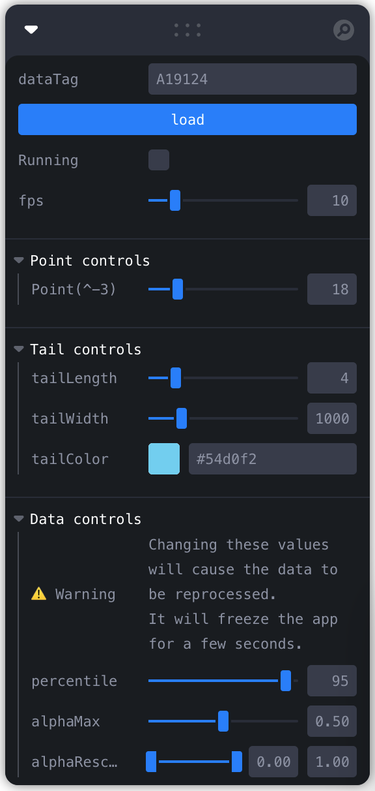

# GFTS point cloud animation

## Installation and Usage
The steps below will walk you through setting up your own instance of the project.

### Install Project Dependencies
To set up the development environment for this website, you'll need to install the following on your system:

- [Node](http://nodejs.org/) v18 (To manage multiple node versions we recommend [nvm](https://github.com/creationix/nvm))
- [Yarn](https://yarnpkg.com/) Package manager

### Install Application Dependencies

If you use [`nvm`](https://github.com/creationix/nvm), activate the desired Node version:

```
nvm install
```

Install Node modules:

```
yarn install
```

## Usage

### Config files
Configuration is done using [dot.env](https://parceljs.org/features/node-emulation/#.env-files) files.

These files are used to simplify the configuration of the app and should not contain sensitive information.

Run the project locally by copying the `.env` to `.env.local` and setting the following environment variables:


| VAR | Description |
| --- | --- |
| `MAPBOX_TOKEN` | Mapbox token for the map |

### Starting the app

```
yarn serve
```
Compiles the sass files, javascript, and launches the server making the site available at `http://localhost:9000/`
The system will watch files and execute tasks whenever one of them changes.
The site will automatically refresh since it is bundled with livereload.

## Data

The app comes bundled with 2 tags, that can be set through the control panel:
- `A19124`: Pallack data with hourly timesteps
- `AD_A11177`: Data with daily timesteps

Getting data for a given TAG has several steps.

1) Setup your credentials for OVH in the `~/.aws/credentials` file under the `ovh_gfts` profile.
2) Download the data for the tag you want. (You want the `states.zarr` file):  
    Example for Pallack data in the destine-gfts-data-lake bucket:
    ```
    aws s3 --profile ovh_gfts --endpoint-url https://s3.gra.perf.cloud.ovh.net/ sync s3://destine-gfts-data-lake/demo/A19124/states.zarr ./raw/A19124/states.zarr
    ```

    Example for data in the gfts-ifremer bucket:
    ```
    aws s3 --profile ovh_gfts --endpoint-url https://s3.gra.perf.cloud.ovh.net/ sync s3://gfts-ifremer/tags/tracks/AD_A11177/states.zarr ./data/AD_A11177/states.zarr
  ```
3) Process the data into the needed csv format. I ran the following in a jupyter notebook:
  ```python
  import xarray as xr

  tag = "A19124"
  data = xr.open_zarr(f"/<path to downloaded data>/{tag}/states.zarr")

  destination = f"/<path for data destination>"

  for i in range(len(data.time)):
    pdf = data.states[i].to_pandas()
    lon = data.states[i].longitude.to_pandas().reset_index().melt(id_vars="y").rename(columns={"value": "lon"})
    lat = data.states[i].latitude.to_pandas().reset_index().melt(id_vars="y").rename(columns={"value": "lat"})

    pdf = pdf.reset_index().melt(id_vars="y")
    pdf = pdf.merge(lon, on=["y", "x"], how="left")
    pdf = pdf.merge(lat, on=["y", "x"], how="left")
    pdf = pdf.dropna().drop(columns=["x", "y"])

    pdf.to_csv(f"{destination}/{tag}_states.csv", index=False, header=False, mode="a")
    with open(f"{destination}/{tag}_states.csv", "a") as f:
      f.write("\n")
  ```
4) Move the processed data into the `/static` folder.
5) Use the control panel to in the app to set the tag you want to visualize.
  
## Map style
The map style being used is the `GFTS PC basemap` in the Devseed account. Update it through mapbox studio and publish to change it.

## Debug Controls



- `dataTag`: The tag to visualize. Press load after changing the tag.
- `Running`: Play/Pause the animation.
- `fps`: The frames per second of the animation. It will unlikely do more than 30fps.
- `Point(^-3)`: The size of the points in the point cloud. The `(^-3)` just means that the value used is 1000 times smaller.

**Tail Controls**  
The tail is the line that connects the highest value of the point cloud across all timesteps.

- `tailLength`: How many previous timesteps to show in the tail.
- `tailWidth`: The width of the tail line.
- `tailColor`: The color of the tail line.

**Data Controls**
- `percentile`: The percentile of the data to show. The data is filtered to show only the values in this percentile. **Setting to 100 will likely cause the app to crash**
- `alphaMax`: The maximum alpha value to use. Meaning that all point will have this alpha value or lower.
- `alphaRescale`: What part of the data is affected by the alpha scale. For example, setting this to [0.1, 0.4] means that the first 10% of the data will have an alpha value of 0 and anything above 40% will have the alpha value set by `alphaMax`. Everything in between will be linearly interpolated.